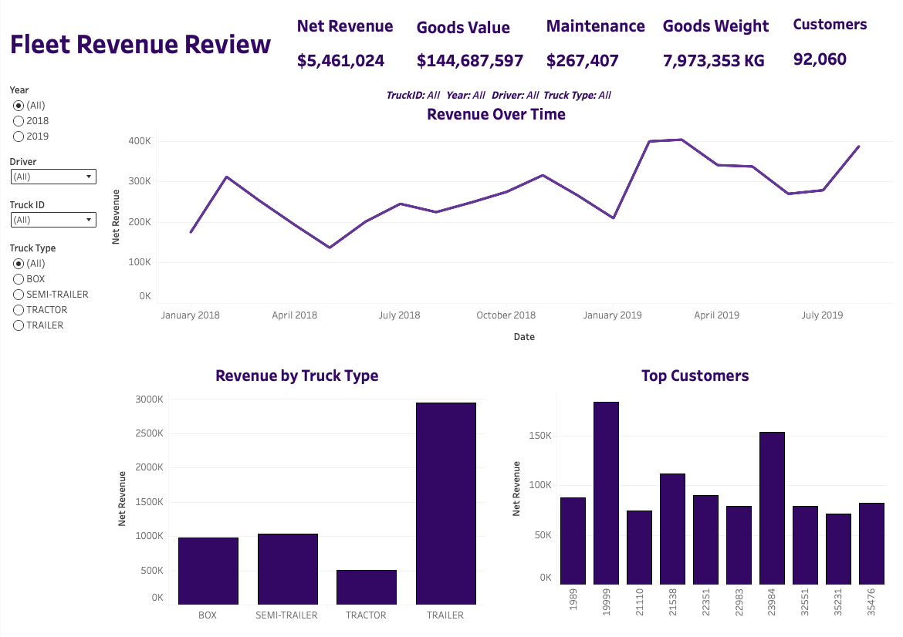

# Freight & Fleet Revenue Analysis 🚛📊

## 📌 Project Overview
This project explores a logistics dataset (sourced from Kaggle) to understand **fleet performance, costs, and revenue**.  
The workflow combines **Python** for data cleaning and preparation with **Tableau** for creating interactive dashboards.  

The goal was to replicate a realistic data analyst workflow:
1. Clean and prepare messy files using Python (Pandas).
2. Load structured datasets into Tableau.
3. Build an interactive revenue dashboard to uncover insights.

---

## 🛠 Tools & Skills Demonstrated
- **Python (Pandas):** data cleaning, formatting, and preprocessing.
- **Tableau:** interactive dashboards, KPIs, and revenue analysis.

---

## 🔄 Workflow
### 1. Python Data Cleaning
- Loaded a mixture of csv and excel files via kagglehub.
- Split the excel files into manageable tables.
- Inspected the tables 
- Converted European-style decimals (e.g., `7,42` → `7.42`).
- Removed duplicate and null rows.
- Exported cleaned datasets for Tableau (`/data/cleaned/`).

### 2. Tableau Dashboard
- Built an **interactive revenue dashboard** combining revenue, costs, and KPIs.
- Added filters for **Year, Truck Type, Driver and Truck ID** to drill down into performance.
- Designed visualisations for:
  - Revenue trends by year
  - Revenue per truck type
  - Top customers by revenue 
  - KPIs

👉 **[View the interactive dashboard here](https://public.tableau.com/app/profile/jason.redding4616/viz/FleetVisualisations/RevenueDashboard)**

---

## 🚀 Key Learnings
- How to combine multiple messy datasets into one analytical workflow.
- The importance of **data cleaning** before visualisation.
- Building dashboards that are **interactive and user-friendly**.

---

## 📂 Repository Structure

- **`Python/`** → Includes the jupyter notebook used to prepare the dataset for Tableau.
- **`Screenshots/`** → Includes a dashboard screenshot from Tableau to provide a preview.
- **`README.md`** → Project documentation and walkthrough.  

---

## 📊 Dataset
- **Dataset sourced from [Kaggle:Logistics Fleet Data](https://www.kaggle.com/datasets/syednaveed05/logistics-fleet-data)**

---

## 📬 Contact  
- **Email:** jasonredding883@gmail.com

