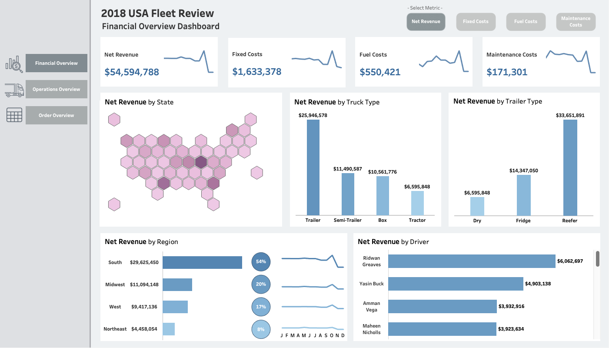
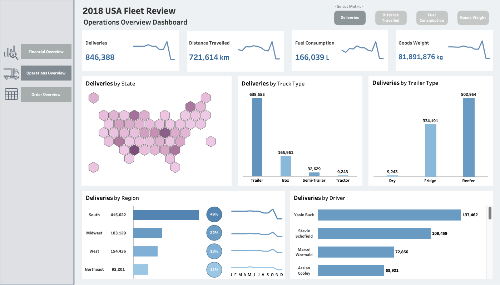
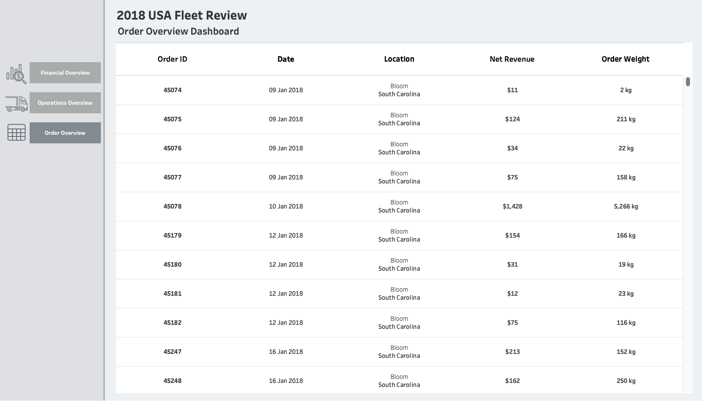

# Freight & Fleet Revenue Analysis 🚛📊

## 📌 Project Overview
This project explores a logistics dataset (sourced from Kaggle) to understand **fleet performance, costs, and revenue**.  
The workflow combines **Python** for data cleaning and preparation with **Tableau** for creating interactive dashboards.  

The goal was to replicate a realistic data analyst workflow:
1. Clean and prepare messy files using Python (Pandas).
2. Load structured datasets into Tableau.
3. Build an interactive multi-page dashboard to uncover insights across financial, operational, and order-level data.

---

## 🛠 Tools & Skills Demonstrated
- **Python (Pandas):** data cleaning, formatting, and preprocessing.  
- **Tableau:** interactive dashboards, KPIs, and fleet performance analysis.  

---

## 🔄 Workflow

### 1. Python Data Cleaning
- Loaded a mixture of CSV and Excel files via KaggleHub.  
- Split the Excel files into manageable tables.  
- Inspected the tables for structure and consistency.  
- Converted European-style decimals (e.g., `7,42` → `7.42`).  
- Removed duplicate and null rows.  
- Exported cleaned datasets for Tableau (`/data/cleaned/`).  

---

### 2. Tableau Dashboards
Built a **three-page interactive Tableau dashboard suite** combining financial, operational, and order insights.  
Each dashboard shares consistent filters for **Truck Type**, **Driver**, and **Truck ID**, enabling smooth exploration across all views.  
While the **map and state-level visuals** remain constant for context, all other charts dynamically update when selecting different metrics.

#### 💰 Financial Overview Dashboard  
  
Displays key financial KPIs and performance indicators across the fleet:
- **KPIs:** Net Revenue, Fixed Costs, Fuel Costs, and Maintenance Costs.  
- **Visuals include:**  
  - Net Revenue by Truck Type  
  - Net Revenue by Trailer Type  
  - Net Revenue by Driver  
  - Net Revenue by Region and State  

Metric buttons allow switching between revenue and cost measures, instantly updating all relevant visuals.

#### 🚚 Operations Overview Dashboard  
  
Focuses on operational performance and delivery efficiency:
- **KPIs:** Deliveries, Distance Travelled, Fuel Consumption, and Goods Weight.  
- **Visuals include:**  
  - Deliveries by Truck Type  
  - Deliveries by Trailer Type  
  - Deliveries by Driver  
  - Deliveries by Region and State  

Users can toggle between operational metrics to understand how the fleet performs across multiple dimensions.

#### 📦 Order Overview Dashboard  
  
Provides a detailed, table-based breakdown of individual deliveries:
- Includes **Order ID, Date, Location, Net Revenue, and Order Weight.**  
- Enables granular tracing of performance at the order level.  
- Complements the visual dashboards with transparent transactional data.  

👉 **[View the interactive dashboards here](https://public.tableau.com/app/profile/jason.redding4616/viz/USAFleetVisualisation/FinancialPerformaceDashboard)**  

---

## 🚀 Key Learnings
- How to combine multiple messy datasets into a structured analytical workflow.  
- The importance of **data cleaning** before visualization.  
- Building dashboards that are **interactive, multi-page, and user-friendly**.  

---

## 📂 Repository Structure
- **`Python/`** → Includes the Jupyter Notebook used to prepare the dataset for Tableau.  
- **`Screenshots/`** → Contains Tableau dashboard screenshots for preview.  
- **`README.md`** → Project documentation and walkthrough.  

---

## 📊 Dataset
- **Dataset sourced from [Kaggle: Logistics Fleet Data](https://www.kaggle.com/datasets/syednaveed05/logistics-fleet-data)**  

---

## 📬 Contact  
- **Email:** jasonredding883@gmail.com  

